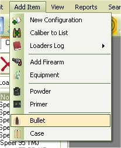
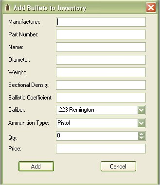
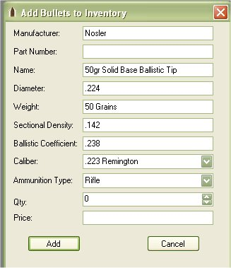

# Add Bullets to Inventory

You can store information about different types of bullets either to keep track of your own inventory or to list for reference.  To add bullets to the database just click on Add Item | Bullet  to access the Add bullet Form.

Everything on the form requires input except for the Part Number, Qty, and Price.   The information that is required is used for the configurations.  If you wish to just put the bullet in just to use as a reference based on a configuration that you got from a friend or from a book, just leave the qty and Price fields blank.

If you wish to keep track of it, put in the qty and price of the box of bullets.

The qty and Price is based on buying a box of bullets of 250 for 39.99, what it will do is break down the price for all 250 bullets to a price per bullet.  This is used in the configuration to let you know how much it costs to make that configuration using this bullet. Any time you use the "Make Ready to use Ammunition" feature it will subtract what you have in inventory.

Once you are done, click on the Add button to add it to the database.