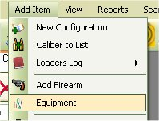
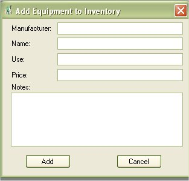
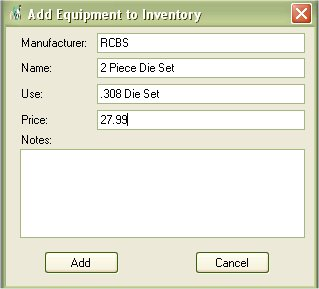

# Adding Reloading Equipment

This is just an option but just in case, it's always helpful to have a list of your reloading equipment just in case.  To add your reloading equipment to the database just click on Add Item | Equipment to access the add form.

Once the form comes up Just type in the Manufacturer, Name, Use, and Price.

Once you are done, just click on the Add button to store the information.  You can View your equipment list from the View Equipment List section

