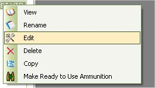

# Edit Configuration - Rifle & Pistol

To edit a configuration all you have to do is click on the Configuration Sheets tab in the main window, Click once on the configuration that you wish to edit, this will select the configuration.  Then Right Click on the configuration to bring up the following menu.

Once the Menu appears click on Edit to start making changes.

## General Details

The General Details window will allow you to Rename the configuration, change the type or change the caliber.

Once you have made your changes in the General Details window, you can click on Save General Details button to save your changes or you can click on Save button All to everything and to Exit the Edit Window.

## Rifle and Pistol Details

 The Rifle and Pistol Details window/tab will allow you to change the Ammunition Type, Bullet, Primer, Case, the Load Type and the Load Source if this was not a personal load.

Once you have made your changes in the Rifle and Pistol Details window, you can click on Save Rifle/Pistol Details button to save your changes or you can click on Save button All to everything and to Exit the Edit Window.

## Powder

The Powder Tab/Window will allow you to change the details of the powder(s) that you have listed for this configuration and it will also allow you to change the default powder for the configuration.

Once you have made your changes in the Powder window, you can click on Save Powder button to save your changes or you can click on Save button All to everything and to Exit the Edit Window.
