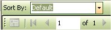

# Report - Reloading Equipment List

You can print out and view the report of the Reloading Equipment that you have listed in your inventory just by clicking on Reports | Equipment Inventory.

You Can use the Sort By Drop Down List to Sort the Columns in a particular order before printing.

As you can see it is how the report will look when you print it out.  To print out the report, just click on the Printer icon (  ) that is located on the menu bar on the report, once you click on that the Print Options will appear:

