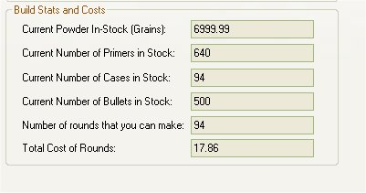

# View Configuration Sheets - Cost & Stats

The Cost & Stats tab is located on the fourth tab while viewing a configuration.   This section will tell you how much it will cost to make live ammunition for this configuration and how many you can make based on the materials listed in your inventory.

## General Costs

The General cost section will break down the price per bullet, primer, case, cost of powder per grain multiplied by the amount of powder needed in the Load Medium. and will display the total cost of what it takes to make 1 live round of ammunition.

From the example above is for a .223 Rem, it costs 8 cents per bullet, 4 cents per primer, 0 cents per primer (used case that I found) and 7 cents of powder (23.5 grains).   Ending Total...19 cents for 1 round of ammunition.

 

## Build Stats and Costs

The Build Stats and Costs will take all the amounts of the materials that you have in inventory that is needed for this configuration.  Based on the information in your inventory, it will let you know how many rounds you can make and how much it will cost to make those rounds.  One of the the things that I like to do is see how much I am saving by comparing the total cost of rounds verses the current cost of ammo on both high and low end manufactured ammunition.

Based on the example above, I have 6999.99 grains of powder ( 1 lbs. or also a new bottle, depends on how you buy).  640 Primers, 1 used case, and 500 bullets in inventory.  Since I have only 1 case available, it will tell me that I can only make 1 round, which will cost me 19 cents.  Since the picture above, My inventory of used brass has in created by 93 cases, as shown below.

Now I can make 94 rounds of ammunition which will cost $17.89 or $19.00 for a 100 if I had it.  Even beats the cost of some of the cheaper ammunition available.