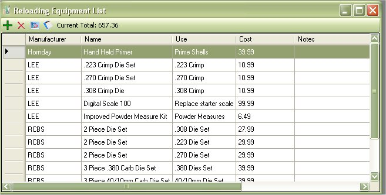
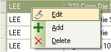
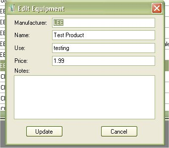
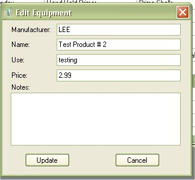

# View Equipment List

The Equipment list will allow you to store a list of your reloading equipment.  A simple method of tracking what you have and how much it costs.  You are also able to print out this list for your records.

To view the equipment that you have in-stock, just click on View | Equipment List.

This is mostly for your viewing pleasure, however, if you wish to add, edit, or delete equipment from this list, you can do so from this window via the tool bar or right clicking on the grid.

Starting from Left to right:

* Add Equipment
* Delete Selected Equipment
* Refresh List
* View Report
* Current Total of all the equipment that is listed in the database.

## Edit Equipment from View

To edit equipment in the list, just click once on the equipment that you wish to edit, this will select the equipment, then Right Click on pull up the Menu, then Click on the Edit option. 

| Before | After |
|:--|:--|
|  |  |

Once you are finished, click on the Update button to save your changes.

### Delete Equipment from View

To Delete an equipment in the list, just click once on the equipment that you wish to delete, this will select the equipment, then Right Click on pull up the Menu, then Click on the Delete option or click on the Red X on the tool bar.

If you are sure this is the equipment that you wish to delete, then click on the Yes button.

