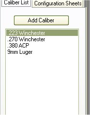

# Adding Caliber to Side List

The My Loaders Log application will allow you to set which kind of caliber's that you reload for.  This is put as an option on the side list of the main form, this is to allow you to narrow down the configuration that you are interested in just by clicking on the caliber in the list to display a window with all the configurations that were made for that caliber.

To Add a Caliber to the list, you can either click on the Add Caliber Button located on the Caliber List tab, or on the top menu you can click on Add Item | Add Caliber to List.

The Form is pretty generic, all you have to do is type in the Caliber that you wish to add to the list, if the caliber is stored in the database it will appear as a suggestion to use. In the sample below, we will add the .308 Winchester to the list.

If there is more then one caliber that you are reloading for, you can click on the Keep Window Open check box to, of course, leave the window open so you can keep adding caliber's to the list without having to constantly click on the Add Caliber button. Just click on the Add Button to add the caliber to the list.

Once you are finished adding a caliber(s) to the list, the Side List on the main form will display the additions that you have made.

