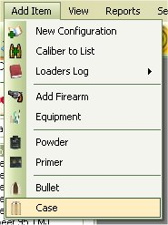

# Add Cases to Inventory

You can store information about different types of bullets either to keep track of your own inventory or to list for reference.  To add cases to the database just click on Add Item | Case  to access the Add Case Form.

Unlike bullets, you can collect and reuse cases.  some people will separate the cases based on the manufacturers and the times that they are used, while others will mix all the cases up and/ keep track of the number of times that they are used.  Either way you do it, you can still store it in the database.  For my handgun loads, all the cases that I collect are mixed all together, while my high powered rifles are mostly tracked by the number of times used, the handgun loads are not.

As you can see, the I used the word Mixed as the manufacturer, and the name had the abbreviations of the manufacturers that are in that collection.  This set is on its first use, I have 100 of them, and it cost me nothing.  You can enter it in as such with out any issues.  Or you can buy a new set and enter in the price, which just like the bullets, it will break down the price per shell to help show you the cost of which ever configuration this case might be used for. Any time you use the "Make Ready to use Ammunition" feature it will subtract what you have in inventory.

Once you are finished, click on the Add button.

