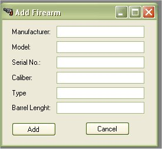

# Adding a Firearm

The My Loaders Log application will allow you to keep a simple inventory of your firearm collection or at least the firearms that you used to test out the reloads.   If you are also a user of the [My Gun Collection Application](http://www.myguncollection.net), you can use the import function to import your firearm collection in the database.

To add a Firearm to the collection, just click on Add Item | Add Firearm

The firearm form is pretty basic, since for reloading, the information that is mostly needed it the type of firearm, barrel length, and caliber.

Just fill in the information and click on the Add button.  Once the Information has been added to the database, a message box will appear stating that the firearm was added to the database.

Just click on the Ok button to exit.
