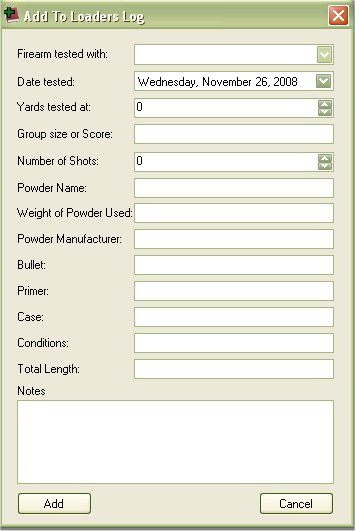
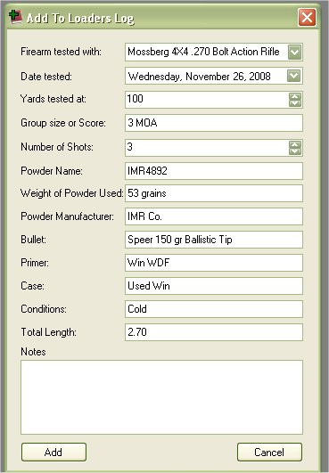

# Add to Loaders Log - Rifle & Pistol - Manual

The Loaders Log allow you to store the test that you have done on one of your firearms with a specific load that you created.  The My Loaders Log application was initially built to keep track of details of the Loader/Reloaders Log in one central place, But also to store more information on what went into making that load.   By allowing you to store configuration of the loads that you have made, it made it quick and easy to add information to the loaders log just by selecting the configuration that you use, and fill out the Date tested, distance, no. of rounds, condition and length.   Quick and easy, but there are times you tested something out and didn't want to add that configuration to the database or you want to move all your logs from paper to the computer but didn't want to add all the inventory information.  That is where being able to add to the loaders log manually comes in handy.  The Manual option is a free form that will allow you to input all the need fields to add to the log.  The only thing that you will have to select from an inventory is the firearm that it was tested on.

To add a manual log entry to the database just click on Add Item | Loaders Log | Rifle/Pistol | Manual to access the Add to Loaders Log Form.

Select the Firearm from the list, and fill out the rest of the information.

Once you are finished entering in your information, just click on the Add button to store it to the database