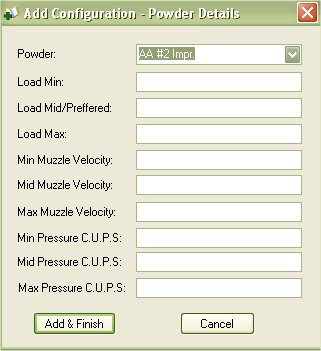
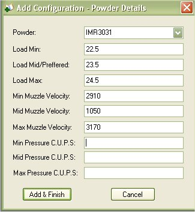

# Adding a New Configuration

The Configurations store what was put into making the ammunition that you are using or what you want to use.  The Configurations where designed to allow you to store your own personal configurations as well as store information from the reloading manuals.

To add a new configuration to the database, just click on the Book with a Plus on the Side Menu in the Configuration Sheets Tab, or you can click on Add Item | New Configuration

The First Window that appears will allow you to Type in the Name of the Configuration (this will appear on the Side menu) the type of ammunition that are loading, and the caliber that it pertains to.  Once you are finished fill out that that information, click on the Next button to proceed to the next window.

The second window will allow you Narrow down the ammunition type, select from a list of bullets that is stored in inventory, a list of primers that are available from inventory, and the cases that you have in inventory.  You can also select if this is a personal load or a load that you got from a book.  If it is a load that you got from a book, it is best that you type in the book that you got this information from, just in case you need to correct something.  Once you are finished click on the Add button to go to the last window.

## Adding Powder Details

The Last Window will allow you to select the powder that was used for this configuration.  The powder list generated from what you have listed in your inventory.  Select the Powder that you used.  The Load Mid/Preferred is the grains of powder that you prefer to use when making this ammunition and is the only thing that is required, everything else on this form is optional.  Once you are finished, click on the Add & Finish button to add the configuration to the database.

If you wanted to add more powders to the list, you can click on the configuration from the side menu to view, then click on the Powder tab, use the Add button to add more powders to this configuration.

