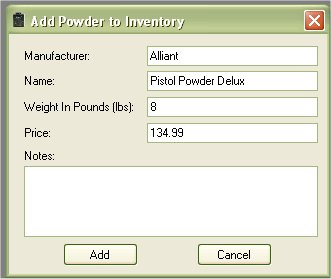

# Add Powder To Inventory

You can store information about different types of powders either to keep track of your own inventory or to list for reference.  To add powders to the database just click on Add Item | Powder  to access the Add Powder Form.

The only thing that is required on this form is the Manufacturer and the Name.   The Weight in pounds and price is optional.  If you just fill out the Manufacturer and the Name you can reference this powder in one of your configurations.   If you wish to keep track of the amount of powder that you have in inventory and the cost of powder used for your configuration, then you will need to type in the weight in pounds and the price.  This is based off a new case of powder, since they are sold in pounds.  It will keep track of it by breaking down the number of pounds to grains (6999.99 grains = 1 lbs.), and the price per grain.  Any time you use the "Make Ready to use Ammunition" feature it will subtract what you have in inventory.

Once you are finished entering in your information, just click on the Add button to store it to the database