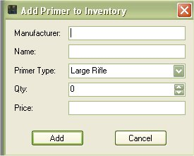
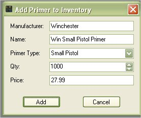

# Add Primers to Inventory

You can store information about different types of primers either to keep track of your own inventory or to list for reference.  To add primers to the database just click on Add Item | Primer  to access the Add Primer Form.

The only thing that is required on this form is the Manufacturer and the Name.   The Qty and price is optional.  If you just fill out the Manufacturer and the Name you can reference this primer in one of your configurations.  If you wish to keep track of the qty of primers that you have in inventory and the cost per primer used for your configuration, then you will need to type in the qty. and the price.  This is based off a new case of primers.  Any time you use the "Make Ready to use Ammunition" feature it will subtract what you have in inventory.

Once you are finished entering in your information, just click on the Add button to store it to the database
