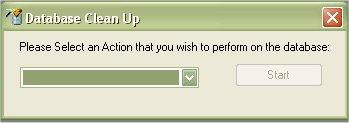

# Database Clean Up

The database clean utility was created to help wipe out the entire database of all the pre-loaded data.  You can have it perform a Remove All Data, which will wipe out everything, allowing you to start 100% fresh or you can select certain preloaded categories to remove from the database. 

To access the Clean-Up Utility, just Click on Tools | Database | Clean Up Database, which will bring up the following window.

Just select the Clean-Up option from the drop down list.

Once you have selected the option that you wish to perform, click on the Start Button.

Once the Delete is complete, it will let you know by displaying the message box above.   Once you click on OK, it will go back to the Clean Up database window so you can select another action to perform, or close out the window if you are done.