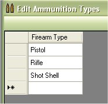
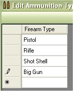
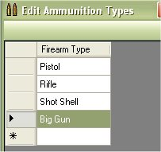

# Edit/Add/Delete Ammunition Types

The ammunition types help match up bullets and configurations, in the My Loaders Log application, we just stuck with the 3 main basics, rifle, pistol and shotgun.  If you wanted to add more, change or delete what we currently have then you can do so just by clicking on Edit | Ammunition Types

Once the list is up, just double click on the name that you wish to edit.

Make the changes that you wish to make.  Then hit your Enter key or click on another field to save your changes.

## Add Ammunition Type

If the 3 main basics are not enough, you can add to the list so you can use in the rest of the application.  Just scroll to the bottom of the list and double click on the blank field.

Type in the new ammunition type that you want to add to the list.  Then hit your Enter key or click on another field to save your changes.

## Delete Ammunition Type

If there was an ammunition type that you wanted to get rid of since it was not in use, All you have to do is click on the column beside that value that you wish to delete to select it.

Once you have the value selected, just hit your Delete key to delete the value from the database.

