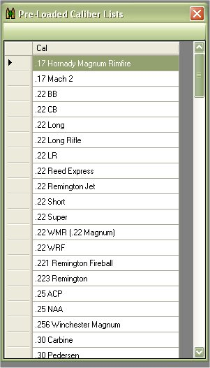

# Edit Pre-Loaded Caliber Lists

The My Loaders Log application comes pre loaded with a list of calibers already listed in the database.  This is mostly used as an auto suggest feature when you are adding a caliber to your list.

If you wanted to Edit, Delete or Add Calibers to that list, you can do so by clicking on Edit | Pre-Loaded Caliber Lists

Locate the Caliber that you wish to edit in the list.  Once you have found the caliber, just double click on the name to start editing.  Just type in the changes and hit your Enter key or click on an another field to save your changes.

## Delete a Caliber from the List

While you have the Pre-Loaded Caliber Lists window up, if there were calibers that you wish to delete from the list, all you have to do is click on the side column of the caliber that you wish to delete. 

Once the row is selected, just hit your Delete key to delete it from the database

## Add a Caliber to the List

While you have the Pre-Loaded Caliber Lists window up, if there were calibers that you wish to add to the list, all you have to do is scroll to the bottom of the list.

Double click on the Blank column and type in what you wish to add to the list.

Once you are finished, just hit your Enter key or click on an another field to save your changes.

