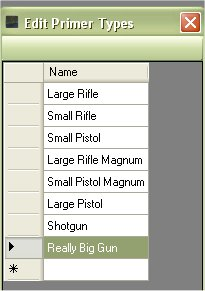

# Edit/Add/Delete Primer Types

The My Loaders Log application comes with a list of know primer types (Small Pistol, Large Pistol, Small Rifle, etc).  If you wanted to edit, add or delete things from that listing, you can do so by clicking on Edit | Primer Type.

Just double click on the value that you wish to edit.

Make the changes that you wish to make.  Then hit your Enter key or click on another field to save your changes.

## Add Primer Type

You can add to the list so you can use in the rest of the application.  Just scroll to the bottom of the list and double click on the blank field.

Type in the new primer type that you want to add to the list.  Then hit your Enter key or click on another field to save your changes.

## Delete Primer Type

If there was a primer type that you wanted to get rid of since it was not in use, All you have to do is click on the column beside that value that you wish to delete to select it.

Once you have the value selected, just hit your Delete key to delete the value from the database.

