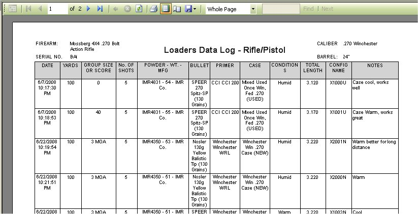

# Reports - Loaders Log With Configuration Name

Unlike the other reports, the Loaders Log Report to print out or to save to file can only be done while [viewing the Loaders Log](View_LoadersLog_RP.md)

This was done only because certain details are required for the Loaders Log Report that can only be retrieved while viewing the regular Loaders Log (Firearm Details).

While Viewing the Loaders log, Click on the down arrow near the printer icon on the tool bar to view your options and Click on With Config.

Once you click on that the report will appear.

As you can see it is how the report will look when you print it out.  To print out the report, just click on the Printer icon (  ) that is located on the menu bar on the report, once you click on that the Print Options will appear:

