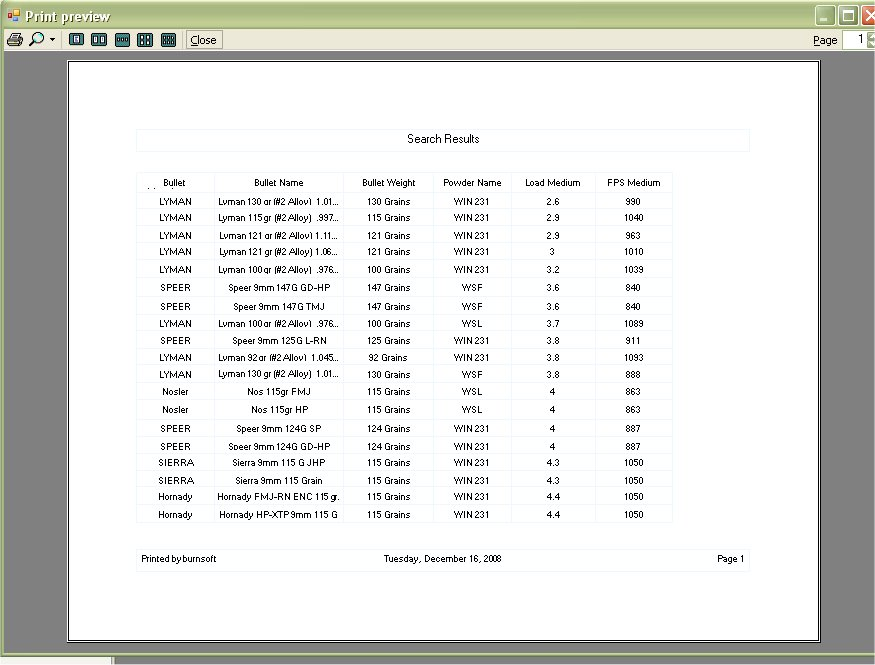

# Search - Rifle & Pistol Configurations

The Search Rifle & Pistol Configuration section was created to allow you to search for specific things through all your configurations.  This is a very handy tool if you have a lot of personal configurations, Imports, or Configurations that you copied from a book.  It will allow you to look and filter through all the configuration and give you a list of all the data that was found.

To Access the Search Rifle and Pistols section just click on Search | Rifle and Pistols.

In this for, Select the fields that you want to search for

Single Item Search

If it is just one item then type in the Look For text box, and select the column that you want to search, then click on the columns that you want to display and click on the Get Results button to view the results report.

Multi Item Search,

Multi Item searches are handy if you want to narrow down your search, In the examples below I want to find all the 9mm configurations that have Winchester powder in it.  To narrow your search just type in the Look For text box, and select the column that you want to search and click on the add button.  Repeat again for the next item. 

Once you are done narrowing your search, then click on the columns that you want to display and click on the Get Results button to view the results report

The Show SQL button will allow you to see or modify the SQL Statement that is used to create the results in the next window.  If you know how to create SQL statements, then this might be useful to you.  The SQL Statements is what is stored for the Saved Report functions, so if you make a SQL Statement that is not a stock statement (meaning you use the interface to create it), it still could be saved so you don't have to do it again.

When you click on the Show SQL button, it will expand the window above to the following window.

The code is generated by clicking on the Generate SQL button.  From here you can modify the statement to your liking.Move the Columns around or if you know how to work with SQL statements then you can create your own.   The FPS Load Medium, Powder Name and Configuration Name were moved around.

Once you are finished, click on the Get Data Button to view the results

As you can see in the picture below, displayed are the results from the information that you have asked for.

The Tool Bar   currently Has 3 Options, Page Setup, Print Preview and Save..in that order.

 

## Page Setup

Sometimes the results might span off the page onto the next page, which is when you will have to use the Page Setup and tell it to use Landscape or you might have to mess with another setting

## Print Preview

The Print Preview button will let you see how the report will look before you send it off to the printer.

This will allow you to see if you have to make any changes to the Page Setup before you print it out.

You can Also use the Section Height, Grid Line Colors Grid Background Colors, and Page layout at the bottom of the results window to format the report on preview.

## Save

You can Save the SQL statement and the Title of the report by clicking on the Save Icon (  )

**NOTE: THIS OPTION IS CURRENTLY DISABLED**

If it is a new report that you are saving it will tell you that the report was saved.

It uses the Page Heading as the reference for the save.

If you try to save the report using the same name of an existing report, it will ask you if you wish to overwrite the existing report, just click on the Yes button to overwrite.

## Exporting Reports

The Regular Reports will allow you to export the reports to an Excel file or PDF File.   In order to try and keep the custom reports up to par with the Stock reports and remain in compliance with BATFE regulations on being able to save the information to a computer file, we added the ability to export the custom report to Text, CSV, HTML or XML file formats.

