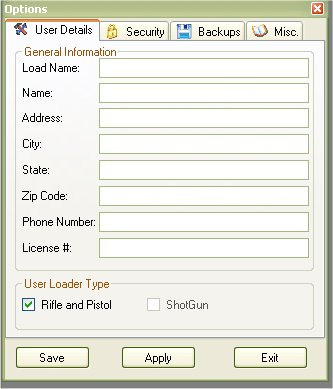
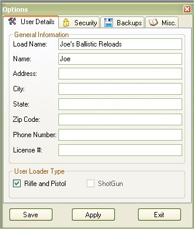
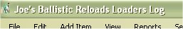
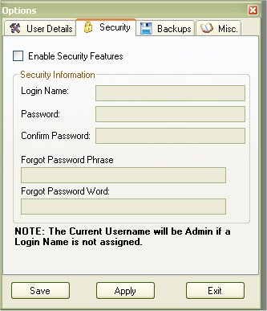
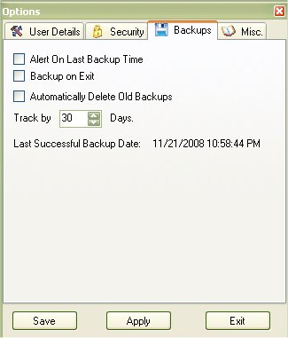
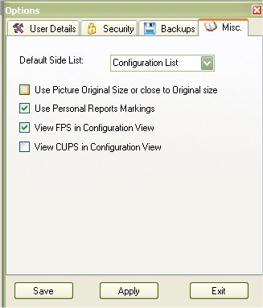

# Tools - Setting Options

The options window will allow you to customize some things in the application.  To access the Options window, click on Tools | Options or click on the tools icon (  ).

## User Details

In the User Details section, all we ask is for what you wish to call your load names, and your name.  Once you have entered in your load name and name click on Save to save and exit or Apply to save.

Why a Load Name, Its just a way to to let you know your ammunition from the manufacturer's ammunition.  Also It will personalize the software based on the name

## Security

The Security Options allow you to lock out the application so others won't be able to see your information.  It enable this feature just click on the Enable Security Features checkbox to enable the rest of the fields.  Then you can type in your user name, password, Forgot Password Phrase, and Forgot Password Word.  Once you are finished click on Save to save and exit or Apply to save.

## Backups

The Backup Options allow you to set special options for the backup application instead of doing everything manually,  you can have it keep track of the last time a backup occurred, set the number of days to remind you to backup your database, automatically delete old backups based on the number of days or even backup the database every time you exit the application. Once you are finished click on Save to save and exit or Apply to save.

## Misc.

The Misc section allow you to set the Default Side list to display when the application starts up, since some may want to see their configurations first, you can set it to have that list on top, otherwise it will default to the Caliber list.  You can also set how you want to the pictures to appear (Picture storing is not available in version 1.x), Use personal report markings, or when viewing a configuration to also allow you to see the FPS or CUPS in the Powder list Tab.

Once you are finished click on Save to save and exit or Apply to save.

