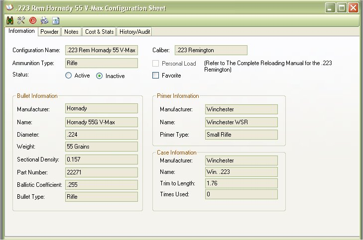
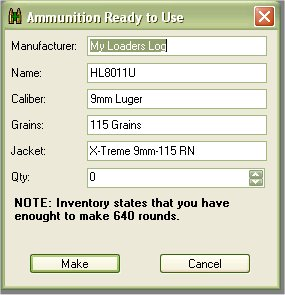
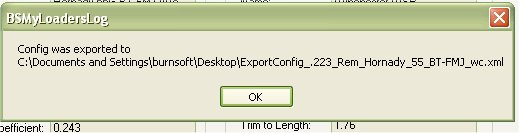
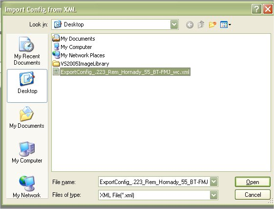

# View Configuration Sheets

The Configuration Sheets are like mini Loader Manuals.  They have the ability to track the loads that you make or ones that you transferred from a reloading manual to the My Loaders Log application.

The Main information that you see in the first 3 tabs (Information, Powder, Notes) are more related to that of a reloading manual.  The Cost & Stats and History/Audit are more for your information to let you know how much it costs to make this kind of ammunition and track the times you made it, along with the total cost of how many you made on the day you did.

You can Print out the configuration sheets to save a hard record, or you can export it to an XML file to store the information digitally or to share with a friend.

## Accessing Configurations

You can access the configs by the list on the left hand side of the main window of the My Loaders Log application.

If you are Viewing the Configuration tab, then just click on the configuration that you are interested in.

If you are viewing the Caliber's Tab, Click on the Caliber that you are interested, and it will display a list of configuration that were made for that caliber, then double click on the configuration that you are interested in.

## The Tool Bar

The Tool Bar has some handy Options such as (starting from left to right)

* Make Live Ammunition for this Configuration Load
* Edit Configuration
* Close Window
* Print Preview Configuration
* Export to XML
 

## Make Live Ammunition for this Configuration Load

This is a quick and easy way to subtract things from your inventory for ammunition that you have just created.

Once you click  on the Ammo Plus icon (  ) the following window will appear:

As you can see The manufacturer is what ever you set for the Load Name in the options section

The Name is the configuration name, and the Caliber, Grains, and Jacket was all pulled from the configuration.

If everything looks ok, all you have to do is type in the amount of ammunition that you made.

As you can see it will calculate what the configuration has listed for materials and calculate how much you can make based on the materials that you have in inventory.

After you type in the Qty, just click on the Make button to finish it all of!

## Export to XML

You can export your configuration to save the an external drive, or send it to a friend to share with.  The export configuration feature was created mostly to swap configurations with friends, but it is also a good way to save unused configurations if you do not wish to keep them in the database.  This will store all the information from the first 3 tabs into a single file.

When viewing a Configuration just click on the Paper World Icon on the Tool bar (  ) to begin the export.

Select the location that you wish to store the configuration to, you can also rename the file to something else other then what is suggested.  The suggested is the Configuration name.  Once you are done, click on the Save button

You will get a confirmation that the file was exported and it's location.  And that is it.

## Import from XML

Just as you can export your configurations to save or give to a friend, you can import the configurations to your database.  Since the Import may contain items that are not listed in your inventory, it will add it with 0 for the qty and 0 for the price.

To Import a Configuration go to the Configurations Tab on the Main window, then click on the Paper World Icon on the Tool bar (  ) to begin the import.

When the import Configuration from XML File form appears, click on the Select Button

Browse to the location of the XML Configuration file

Once selected, Click on the Open Button to set

Now you are ready to Import the file to your collection.  So Click on the Import button to begin.

Once it is finished, you will get a message box stating the the import was complete, When you click on the Ok button, it will refresh your configuration list on the side of the Main Window..

