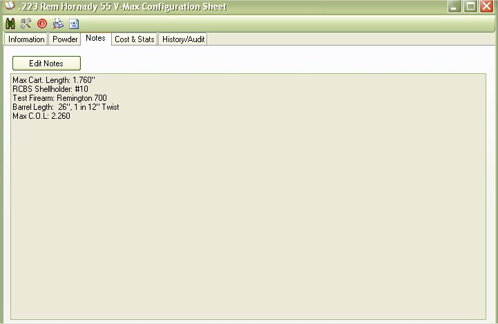
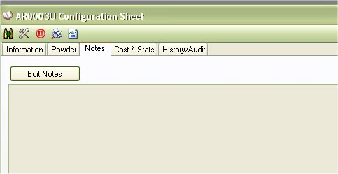
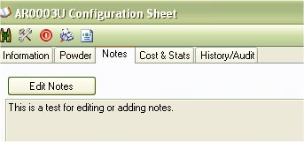

# View Configuration Sheets - Notes

The Notes section is the third tab while viewing a configuration.  This is a free form area that will allow you to type any notes that you wish to make about this configurations.

Since the Picture above is a referred load, it has the details of the test according to the book that it was collected from.  This section is Optional.

## Edit or Add a Note

While viewing a configuration and in the notes section, just click on the Edit Notes button to enable the free form

Type in what you wish, once you are done, click on the Update button to save.

And that is how you add and edit the notes section.

