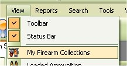
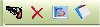

# View Firearm Inventory

To view the firearms that you added or imported to the My Loaders Log application, just click on View | My Firearm Collections.

This is mostly for your viewing pleasure, however, if you wish to add, edit, or delete a firearm from this list, you can do so from this window via the tool bar or right clicking on the grid.

Starting from Left to right

* Add Firearm
* Delete Selected Firearm
* Refresh List
* View Report
 

## Editing a Firearm.

To edit a firearm in the list, just click once on the firearm that you wish to edit, this will select the firearm, then Right Click on pull up the Menu, then Click on the Edit option. 

| Before | After |
|:--|:--|
|  |  |

Once you are finished, click on the update button to save your changes.

## Delete Firearm from List

To Delete a firearm in the list, just click once on the firearm that you wish to delete, this will select the firearm, then Right Click on pull up the Menu, then Click on the Delete option or click on the Red X on the tool bar.

If you are sure this is the firearm that you wish to delete, then click on the Yes button.

