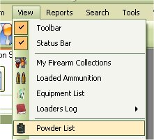
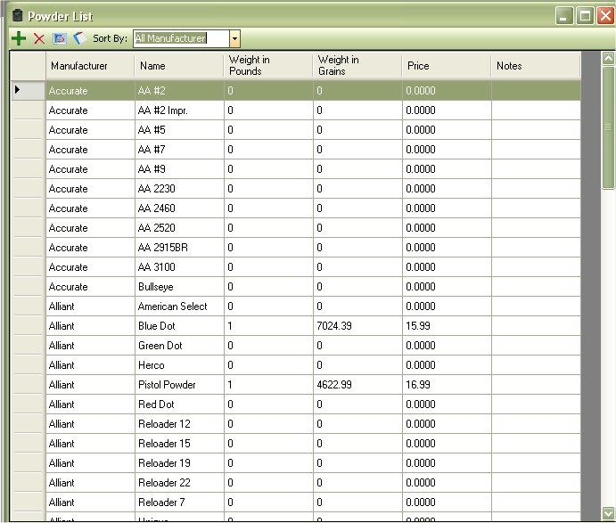
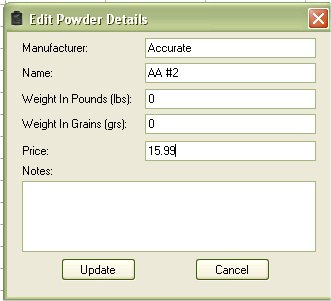

# View Powder List

The Powder list will allow you to store a list of your reloading Powder.  It's simple method of tracking what you have and how much it costs.  You are also able to print out this list for your records.

To view the Powder that you have in-stock, just click on View | Powder List.

The Powder list will store all the powder that you may or may not have.  If you added powder for a configuration, or imported a configuration it will show up in the list.

As you can see how it is laid out, the Powders with 0 Weight in Pounds, 0 Grains, and ) price where powders that were used for configurations.  The ones that have more than 0 listed as the ones that I have in stock.  When you added powder and you stated that you had 1 pound for powder it broke it down to 6999.99 grains of powder.  Which was done to help keep track of how much you have left after making a couple of rounds of ammunition.  reference

If you wish to add, edit, or delete powder from this list, you can do so from this window via the tool bar or right clicking on the grid.

Starting from Left to right:

* Add Powder to List
* Delete Powder from List
* Refresh List
* View Report
* Sort List By All, In-stock and Out - of - Stock
 

## Edit Powder from View

To edit powder in the list, just click once on the powder that you wish to edit, this will select the powder, then Right Click on pull up the Menu, then Click on the Edit option. 

| Before | After |
|:--|:--|
|  |  |

Once you are finished, click on the Update button to save your changes.

## Delete Powder from View

To Delete a powder in the list, just click once on the powder that you wish to delete, this will select the powder, then Right Click on pull up the Menu, then Click on the Delete option or click on the Red X on the tool bar.

If you are sure this is the powder that you wish to delete, then click on the Yes button.

## Using the Sort By

The Sort By Drop down box will allow you to filter through the list of powder based on the Selected option such as All, everything that you have in stock and every thing that you don't have in stock.

Since the list also stores powder that you may not have but is listed in a configuration that you might have added or imported, this list will help you look at the powders that you have and not all the powders that you may or may not have.  The Example below will show the difference between all, in-stock,  reference and out-of-stock.

### All

### InStock

### Out-Of-Stock

### Reference

