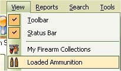
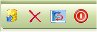

# View Ready to Use Ammunition

The Ready to Use Ammunition section stores the ammunition that you have created from a configuration. You can use to to keep track of what you have made or if you are a user of the My Gun Collection Application, then you can export the ammunition list into the ammunition inventory section of the My Gun Collector application.

To view the ammunition that you have created, just click on View | Loaded Ammunition.

This is mostly for your viewing pleasure, however, if you wish to export to the My Gun Collection application or delete ammunition from this list, you can do so from this window via the tool bar.

Starting from Left to right:

* Export to My Gun Collection
* Delete
* Refresh List
* Close Window
 

## Export Ammunition to My Gun Collection

The export function is pretty simple, it will export all the ready to use ammunition in the list to the Ammunition Inventory section in the My Gun Collection (MGC) database.  If you already have a load name with the same manufacturer and name in the MGC, it will add to the qty of what is already listed, then once the export is complete, it will delete the "Ready to Use" ammunition in the My Loaders Log Database. 

**NOTE: This feature is only available if you have the My Gun Collection application installed on your machine!**

To Export the "Ready to Use" Ammunition, just click on the 1st icon on the left (   ) and the following window will appear:

Click on the Yes button to export

## Delete Ready to use Ammunition

Click on the Ammunition that you wish to delete, then click on the delete (  ) button on the tool bar.

