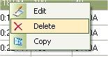
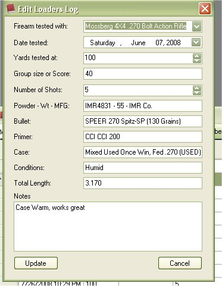
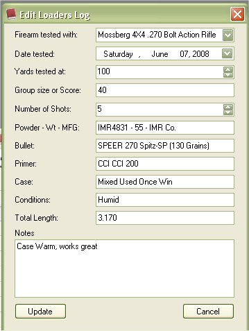

# View Loaders Log - Rifle & Pistol

Just like you use to with paper, you can keep a log of the loads that you have created for your firearms.  Logging the loads that I created was the reason why I came up with this application.  Of course one idea spawns into another and there is always room to grow with it.  The Loaders Log for this application will allow you to enter in data from your configurations, or even free hand entries are welcomed as well.  Instead of using a binder to keep track of all your loading logs, you can use this application to store that information. 

To Access the Loaders Log for Rifle & Pistol, just Click on View | Loaders Log | Rifle / Pistol from the main window.

Using the view is a way you can navigate through you different loads based on the firearm that you tested it with.  The Tool bar will contain the firearms that you have listed in the Firearm Collect list.  When you select a firearm, it will look for all the logs that is listed for that firearm.   The Tool Bar will also change to display the Serial no, Caliber, and Barrel Length.

## The Tool Bar.

From Left to Right:

1. Current/selected Firearm
2. Add to Log for this firearm via Manually, or by using a configuration.

3. View/Print Report for this firearm with Configuration Name listed or Without Configuration Name Listed.

4. Serial number of selected firearm
5. Caliber of selected firearm
6. Barrel Length of selected firearm.
7. Delete Selected Log Entry

## Edit Rifle & Pistol Loaders Log Entry

To edit the Loaders Log entry in the list, just click once on the Log entry  that you wish to edit, this will select the Log entry , then Right Click on pull up the Menu, then Click on the Edit option. 

| Before | After |
|:--|:--|
|  |  |

Once you are finished, click on the Update button to save your changes.

## Delete Rifle & Pistol Loaders Log Entry

To Delete a Loaders Log entry in the list, just click once on the Log entry that you wish to delete, this will select the Log entry, then Right Click on pull up the Menu, then Click on the Delete option or click on the Red X on the tool bar.

If you are sure this is the Log entry that you wish to delete, then click on the Yes button.