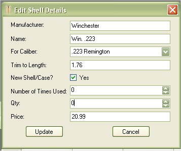
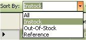
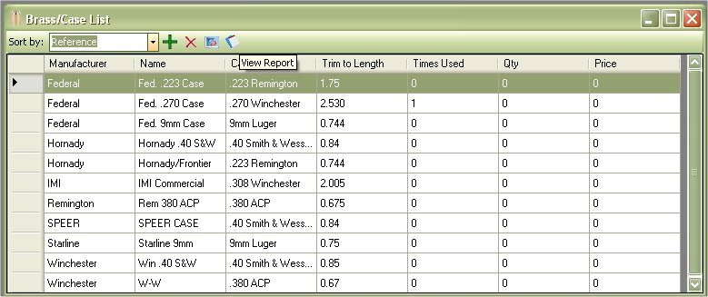

# View Case/Brass List

The Case list will allow you to store a list of your reloading Case.  It's simple method of tracking what you have and how much it costs.  You are also able to print out this list for your records.

To view the Case that you have in-stock, just click on View | Case List.

The Case list will store all the Case that you may or may not have.  If you added Case for a configuration, or imported a configuration it will show up in the list.

As you can see how it is laid out, the Cases with 0 Weight in Pounds, 0 Grains, and ) price where Cases that were used for configurations.  The ones that have more then 0 listed as the ones that I have in stock.  When you added Case and you stated that you had 1 pound for Case it broke it down to 6999.99 grains of Case.  Which was done to help keep track of how much you have left after making a couple of rounds of ammunition.  reference

If you wish to add, edit, or delete Case from this list, you can do so from this window via the tool bar or right clicking on the grid.

Starting from Left to right:

* Add Case to List
* Delete Case from List
* Refresh List
* View and Print Case Report.
* Sort By All, Out-Of-Stock, InStock and Reference

## Edit Case from View

To edit Case in the list, just click once on the Case that you wish to edit, this will select the Case, then Right Click on pull up the Menu, then Click on the Edit option. 

| Before | After |
|:--|:--|
|  |  |

Once you are finished, click on the Update button to save your changes.

## Delete Case from View

To Delete a Case in the list, just click once on the Case that you wish to delete, this will select the Case, then Right Click on pull up the Menu, then Click on the Delete option or click on the Red X on the tool bar.

If you are sure this is the Case that you wish to delete, then click on the Yes button.

## Using the Sort By

The Sort By Drop down box will allow you to filter through the list of Case based on the Selected option such as All, everything that you have in stock and every thing that you don't have in stock.

Since the list also stores Case that you may not have but is listed in a configuration that you might have added or imported, this list will help you look at the Cases that you have and not all the Cases that you may or may not have.  The Example below will show the difference between all, in-stock, reference and out-of-stock.

### All

### InStock

### Out-Of-Stock

### Reference

