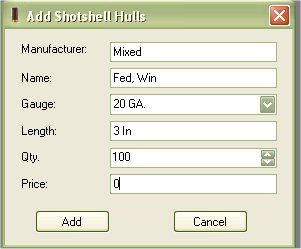

# Add Shell Hulls to Inventory

You can store information about different types of Shell Hulls either to keep track of your own inventory or to list for reference.  To add Shell Hulls to the database just click on Add Item | Shell Hull  to access the Add Shell Hull Form.

Everything on the form requires input except for the Qty, and Price.   The information that is required is used for the configurations.  If you wish to just put the Shell Hull in just to use as a reference based on a configuration that you got from a friend or from a book, just leave the qty and Price fields blank.  Any time you use the "Make Ready to use Ammunition" feature it will subtract what you have in inventory.

Once you are done, click on the Add button to add it to the database.